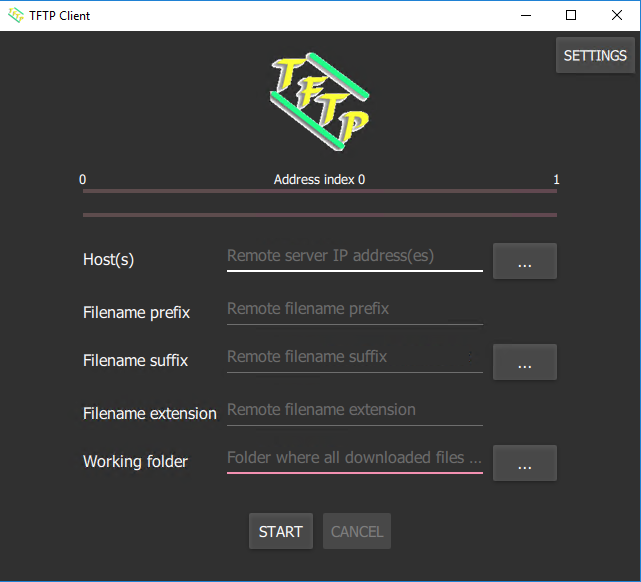

# TFTP Client

Client used to get files from a list of servers using TFTP protocol. A file prefix, a list with file suffixes, the file extension and the working folder can be specified. Internaly, a pool of threads is used to download in parallel files from each server. All OSs supported by Qt are supported and a bat script is provided in order to generate the Windows installer.

# Dependences

- Qt 5.13+

- cmake

- Visual Studio 2017+

- NSIS (only for installer generation)

In order to compile and generate the installer use build-win-release.bat script.

